============================
Response After Send Template
============================

Once You :doc:`Configure WhatsApp Template  <../template/template_configuration>` in your Odoo database. Now You can send
the Template To Your end-client through Whatsapp Message.

You can Send The Template from any `Model` for which you have created template and the template is in :guilabel:`Approved`
State. You have to pass the `Model` name  as field `Applies To` at the time of creation of a whatsapp template.
Let's say user has created the whatsapp template named as `Odoo Sale`, selected the field `Applies To` as `Contacts`
and user has state of that template is as `Approved`. So user will be able to see Whatsapp button in the **Chatter** of the
form view of `Contacts`.

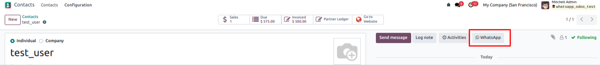

Click on the button :guilabel:`WhatsApp`. Popup will open.

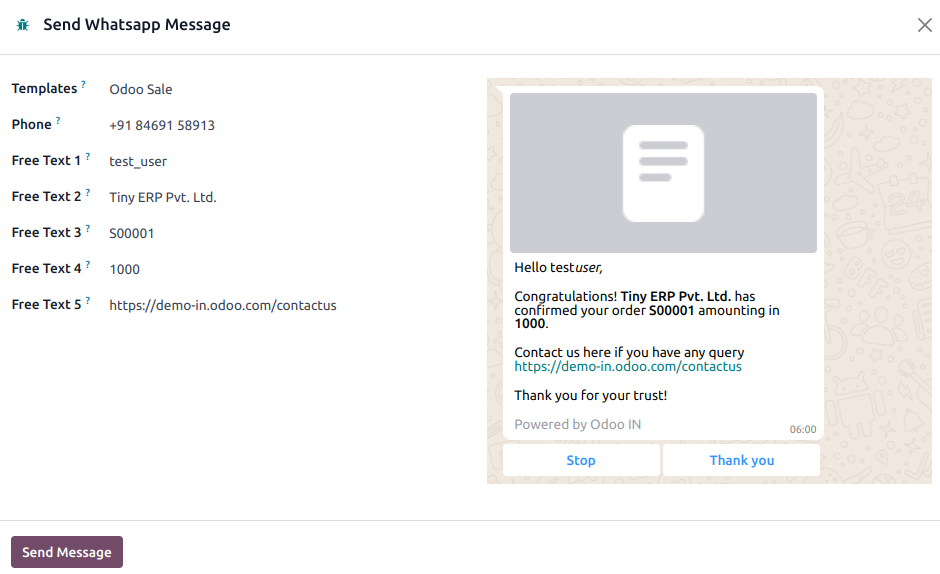

Select the template and click on the :guilabel:`Send Messsage`. After few seconds you can see the `Logs`
in the Chatter.

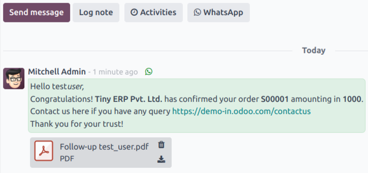

Now End-user to whom bussiness has sent the Document must have received the Documnent in their WhatsApp Account associated
with the phone number of that End-user in Odoo database.

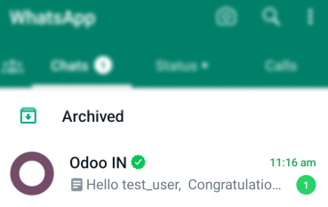

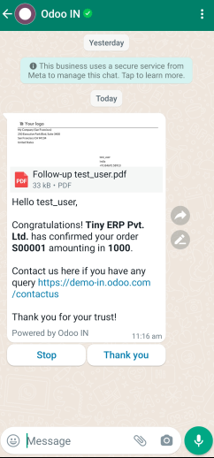

Still There would be No Channel created in :guilabel:`Discuss` for that Document.

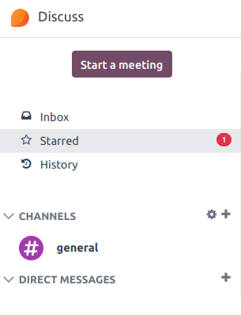

Now, Let's say end-user replies from their WhatsApp. It will create a new channel in **Discuss**
for that Document. Conversation beetween the Bussiness and End-Client can be see from that channel.

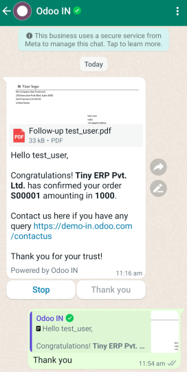

You will be able to see new channel is created for that Document.

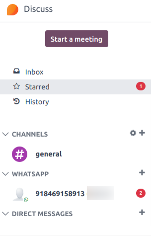

You can see the replies from Whatsapp user in this channel.

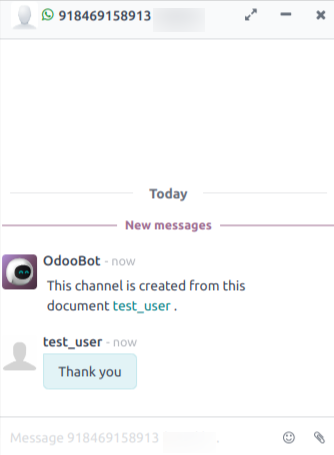

You can reply to End-user from that channel. It will send the WhatsApp message to end-user.

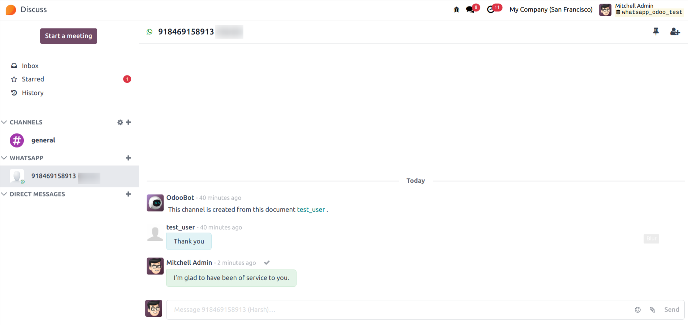

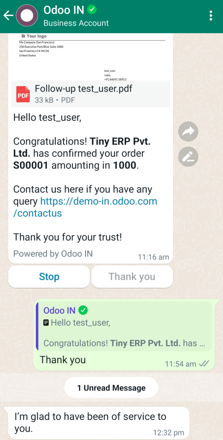

Once WhatsaApp User reads your message you can see your message getting double ticked in **Discuss Chat**.
It indicates that the your sent message has been read.

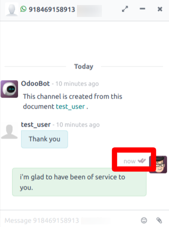

Now, Go To :menuselection:`Sales --> Orders`.  Create a Sale Order for the customer
that you want the order to be sent via WhatsApp.

 .. note::
      You must have the Template for the `Sales Order` that is in the `Approved` state. Then only
      :guilabel:`Whatsapp` button will be shown in the Chatter of the Sales Order.

 .. image:: response_after_send_template/sale_order_wapp_icon.png
   :align: center
   :alt: Channel created in Discuss

Click on the :guilabel:`Whatsapp` button to send the Document of the Sale Order. Again Popup will open. Click on the
:guilabel:`Send Message`. Customer set on that Sale Order will receive document related to that Template.

 .. note::
      WhatsaApp message will be sent to the WhatsaApp Account Associated with `Phone Field` of the
      Template.

 .. image:: response_after_send_template/wapp_sale_order.png
    :align: center
    :alt: Channel created in Discuss

When end-user replies on that Sale Order document. There will be a seperate WhatsApp Channel
created in Discuss for that document.

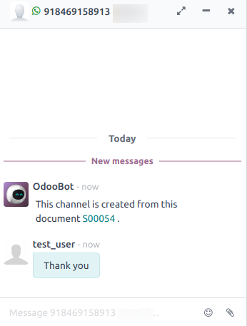

If There is no further reply from end-user in last 24 hours than it will unpin that document's Channel.
