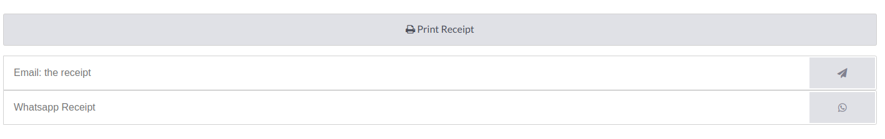

========================================
WhatsApp Template With POS Configuration
========================================

WhatsApp Template 
-----------------

In the Whatsapp Template POS model are selected :guilabel:`applies to fields` to selected point of sale order

The header type is compulsory to select an :guilabel:`image` for POS.

In POS
------

Go to :menuselection:`pos->configuration->settings->Tick whatsapp enabled->choose receipt template`.

.. image:: whatsapp_template_pos/pos_config.png
   :align: center
   :alt: POS Configuration Setting in Odoo whatsapp

Start a Session
~~~~~~~~~~~~~~~

From the POS dashboard, click New Session, and at the Opening Cash Control screen, click Open Session to start a POS session, or click Continue Selling if the session is already opened.

Click on products to add them to the cart and set customers 

Once an order is done, click Payment to move to the payment screen. Click Invoice under the customer’s name And Select the payment method and click Validate. The invoice is automatically issued and ready to be downloaded and/or printed.

After a successful payment, you receive a WhatsApp button. When you click on the WhatsApp, the POS receipt and invoice for your specific purchase will be sent to you via WhatsApp.

