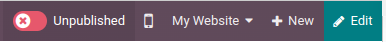

:show-content:

=====
Pages
=====

Odoo allows you to create pages for your website and customize their contents and appearance to your
needs.

Page creation
=============

Website pages can be created from the **frontend** and from the **backend**. To create a new website
page, proceed as follows:

  #. - Either open the **Website** app, click :guilabel:`+ New` in the top-right corner, then select
       :guilabel:`Page`;
     - Or go to :menuselection:`Website --> Site --> Pages` and click :guilabel:`New`.
  #. Enter a :guilabel`Page Title`; this title is used in the menu, as well as the page's URL.
  #. Disable :guilabel:`Add to menu` if the page should not appear in the menu.
  #. Click :guilabel:`Create`.
  #. Customize the page's contents and appearance using the Website Builder, then click
     :guilabel:`Save`.
  #. :ref:`Publish <website/un-publish-page>` the page.

Page management
===============

.. _website/un-publish-page:

Publishing/unpublishing pages
-----------------------------

To publish or unpublish a page, toggle the switch in the upper-right corner from
:guilabel:`Unpublished` to :guilabel: `Published`, or vice versa.

.. tip::
   You can also:

    - publish/unpublish a page from the :ref:`page properties <website/page_properties>`;
    - publish/unpublish several pages: Go to :menuselection:`Website --> Site --> Pages`, select the
      pages, then, in the :guilable:`Action` menu, select :guilabel:`Publish` or
      :guilabel:`Unpublish`.

.. _website/page_properties:

Homepage
-------

By default, when you create a website, Odoo creates a homepage for it with the Page Title "Home" and
the Page URL "/". However, you can define any page as your homepage if you want to. To define a page
as your homepage

- Go to properties
- or go to settings

NEXT: test what happens when you create website: is the homepage (url /) automatically created?
If so, mention that + explain how you can use another page (in settings + in properties)

You can define a dedicated homepage for you website, or use any other page as the homepage.

To define

Page properties
---------------

To modify a page's properties, access the page you wish to modify, then go to
:menuselection:`Website --> Site --> Properties`.

The :guilabel:`Name` tab allows you to:

- rename the page using the :guilabel:`Page Name` field;
- modify the :guilabel:`Page URL`. In this case, you can redirect the old URL to the new one. To do
  so, toggle the :guilabel:`Redirect Old URL` switch, then select the :guilabel:`Type` of
  redirection.

  .. image:: pages/page-redirection.png
     :alt: Redirect old URL

You can further adapt the page's properties in the :guilabel:`Publish`: tab:

- :guilabel:`Show in Top Menu`: Enable if you want the page to appear in the **bar menu** at the
  top;
- :guilabel:`Use as Homepage`: Enable if you want the page to be the homepage of your website;
- :guilabel:`Indexed`: Enable if you want the page to be **indexed**;
- :guilabel:`Published`: Enable if you want the page to be **published** and accessible to all
  visitors;
- :guilabel:`Publishing Date`: Select a date and time if you want to automatically **publish** your
  page on the set date and time;
- :guilabel:`Visibility`: Select who can access the page: :guilabel:`All`, :guilabel:`Signed In`,
  :guilabel:`Restricted Group`, or :guilabel:`With Password`.

You can also :guilabel:`Duplicate Page` or :guilabel:`Delete Page` from either tab. Alternatively,
you can access *some* of those options by going to :menuselection:`Website --> Site --> Pages`.

.. note::
   (note on URLs)

.. seealso::
   :doc:`pages/seo`

Duplicating pages

redirecting pages

Deleting pages

- Redirect instead of delete
- the page will be removed from the menu,
- need to update links (delete page window lists all links referring to the page so you can update
them)

Customization
~~~~~~~~~~~~~

Y

.. toctree::
   :titlesonly:

   pages/seo
